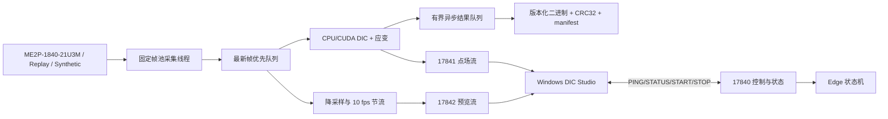

# 软件架构

## DIC Edge

- 相机接口 `ICamera` 隔离 GalaxySDK、回放和合成输入；
- 采集线程只负责取帧，计算线程永远优先处理最新帧；
- 固定帧池避免实时循环持续分配全分辨率图像；
- DIC 结果先计算位移，再用规则网格局部最小二乘计算小应变；
- 网络断开不会停止当前实验，二进制结果继续写入计算盒；
- 计算线程只负责结果入队，独立线程批量写盘；队列满会显式 fault，绝不静默丢结果；
- 结果流只保存最新版，慢客户端不会让 Edge 内存无限增长。

## DIC Studio

- 控制请求有 2.5 秒超时，不会永久卡在“忙碌”；
- 状态、点场、预览分别重连；
- 点场 CRC 校验通过后才进入云图和曲线；
- 支持 `u/v/exx/eyy/exy/quality` 云图、512 样本时间曲线与 Hann 窗 FFT；
- 空闲时远程配置 Exposure/Gain/Trigger/ROI/FPS/DIC 网格，显式保存并保留 `.bak`；
- 预览两点尺度标定，u/v 可显示 mm，云图点击即可选择 FFT 测点；
- Studio 不承担 DIC 计算，关闭 Studio 不影响 Edge 测量。

## 性能策略

全幅 Mono8 每帧约 18.45 MB，21.4 fps 原始负载约 395 MB/s。因此原图不远程全速传输，
默认仅发送 960×720 内、10 fps 的预览；DIC 点场使用二进制结构，避免 CSV 文本网络开销。
CUDA 构建使用页锁定帧池、非阻塞 stream 和异步拷贝；核函数用 warp shuffle 一次归约六组
Gauss–Newton/ZNCC 累加量。Edge STATUS 暴露各阶段滚动 P50/P95/P99 和写盘队列水位。
